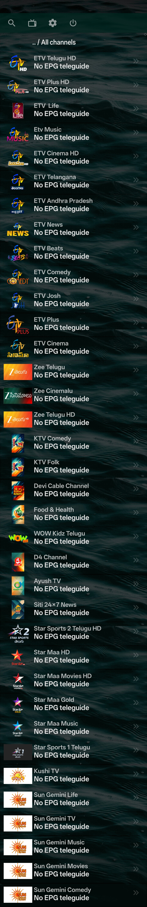

# 📺 Telugu Live TV - Free M3U Playlist

> **A curated collection of 100+ Telugu live television channels (constantly updated).**  
> Stream directly on Android TV, Firestick, mobile devices, and PC using a single URL.

---

### 🖼 Preview & Player Setup

---

## 🔗 Direct M3U Playlist URL

Copy and paste this URL into your preferred IPTV player:

https://tinyurl.com/telugu-m3u

---

## ⚡ Key Features

* **100+ Channels Ready:** Includes popular Telugu news, entertainment, movies, music, and devotional channels, with new streams actively added.
* **Continuous Updates:** Inactive or dead links are refreshed regularly so you never have to change your playlist URL.
* **Structured Categories:** Well-organized channel groups (`News`, `Entertainment`, `Movies`, `Music`, `Kids`, and `Spiritual`).
* **High-Quality Logos & EPG Ready:** Optimized with clean `tvg-logo` tags and standard XMLTV EPG IDs for easy navigation.
* **100% Free & Fast Loading:** Direct public streams with minimal buffering, requiring no subscription or login.

---

## 📱 Supported Platforms & Applications

This playlist works seamlessly on all standard M3U / M3U8 compatible media players:

| Platform | Recommended Apps |
| :--- | :--- |
| **Android TV / Firestick** | TiviMate, OTT Navigator, Sparkle TV |
| **Android Mobile / Tablet** | OTT Navigator IPTV, IPTV Smarters Pro, VLC |
| **Windows / macOS** | VLC Media Player, PotPlayer, Kodi |
| **iOS / Apple TV** | GSE Smart IPTV, IPTVX, Smarters Player |

---

## 🛠 Setup Instructions

1. Open your preferred IPTV player (e.g., **TiviMate** or **OTT Navigator**).
2. Navigate to **Settings** > **Add Playlist** (or **M3U Playlist**).
3. Paste the playlist URL:
   `https://tinyurl.com/telugu-m3u`
4. Set the playlist name to **Telugu TV** and save.
5. All channels will load automatically, organized by category.

---

## 🔄 Updates & Channel Requests

New channels and stream fixes are added on an ongoing basis. If you find a broken stream or want to request a channel, feel free to open an **Issue** on this repository.

---

## ⚠️ Disclaimer

This repository only aggregates publicly available, free-to-air stream links found on the internet. No media files are hosted, stored, or re-broadcasted directly on this server. All copyrights and trademarks belong to their respective broadcasting networks.
